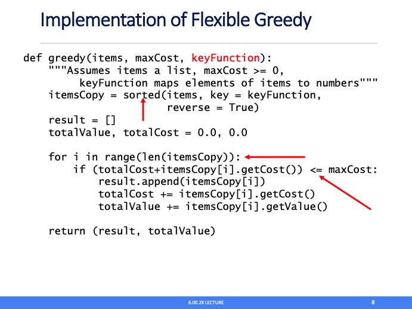

Author: Pytrick 🌰

contents in lecture 1:
1. What Is an Optimization Model?
    * A greedy algorithm is often a practical approach to finding a pretty good approximate solution to an optimization problem
2. Knapsack Problem
3. Brute Force Algorithm
    * Enumerate all possible combinations of items. 
    That is to say, generate all subsets of the set of subjects. This is called the **power set**.
    * Remove all of the combinations whose total units exceeds the allowed weight.
    * From the remaining combinations choose any one whose value is the largest.
4. Brute Force is Often Not Practical
5. Greedy Algorithm a Practical Alternative
6. The Pros and Cons of Greedy

