Author: Pytrick 🌰
---

contents in lecture 2:
* The Pros and Cons of Greedy
* Brute Force Algorithm
    * Enumerate all possible combinations of items. 
    * Remove all of the combinations whose total units exceeds the allowed weight.
    * From the remaining combinations choose any one whose value is the largest.
* Search Tree Implementation

---

* Search Tree Algorithm
    * Gave us a **better** answer than any of the greedy solutions
    * Finished quickly

* Is It Hopeless?
    * In theory, yes. In practice, no!
    * Dynamic programming to the rescue    

* Recursive Implementation of Fibonnaci

```python
def fib(n):

    if n == 0 or n == 1:
        return 1 
    else:
        return fib(n - 1) + fib(n - 2)

fib(120) = 8,670,007,398,507,948,658,051,921
```

* Dynamic Programming? 
> “The 1950s were not good years for mathematical research… I felt I had to do something to shield Wilson and the Air Force from the fact that I was really doing mathematics... What title, what name, could I choose? ... It's impossible to use the word dynamic in a pejorative sense. Try thinking of some combination that will possibly give it a pejorative meaning. It's impossible. Thus, I thought dynamic programming was a good name. It was something not even a Congressman could object to. So I used it as an umbrella for my activities.
>-- Richard Bellman


* Using a Memo(memoization )/**Dynamic Programming** to Compute Fibonnaci
    * Trade a time for space 
    * Create a table to record what we’ve done
    * Before computing fib(x), check if value of fib(x) already stored in the table ◦ If so, look it up ◦ If not, compute it and then add it to table ◦ Called memoization
```python
def fastFib(n, memo = {}):

    """Assumes n is an int >= 0, memo used only by recursive calls Returns Fibonacci of n""" 
    if n == 0 or n == 1:
        return 1 
    try:
        return memo[n] 
    except KeyError:
        result = fastFib(n-1, memo) + fastFib(n-2, memo) 
        memo[n] = result 
        return result
```
* when should we use Memo ?
    * Optimal substructure: a globally optimal solution can be found by combining optimal solutions to local subproblems
        * `For x > 1, fib(x) = fib(x - 1) + fib(x – 2)`
    * Overlapping subproblems: finding an optimal solution involves solving the same problem multiple times
        * Compute fib(x) or many times
        
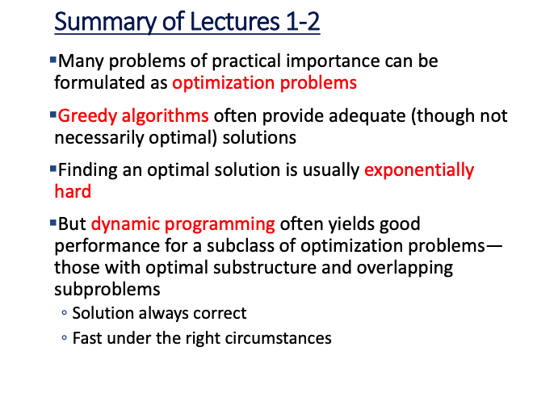
        

---
---
---

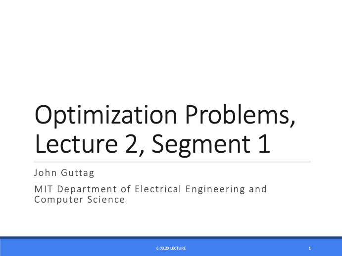
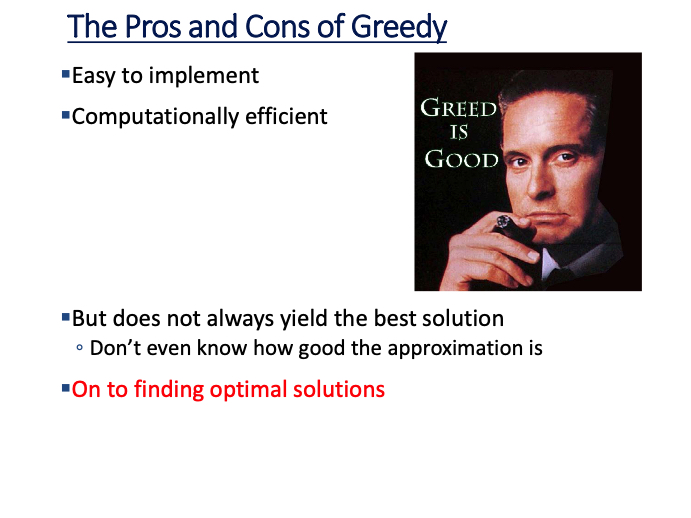
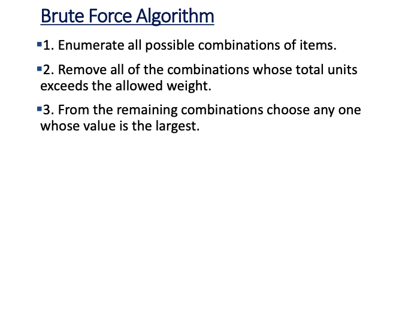
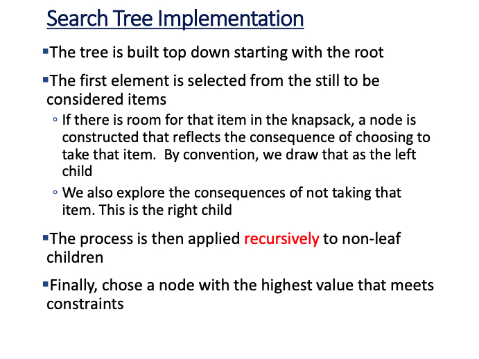
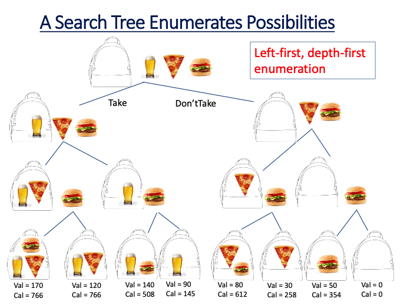

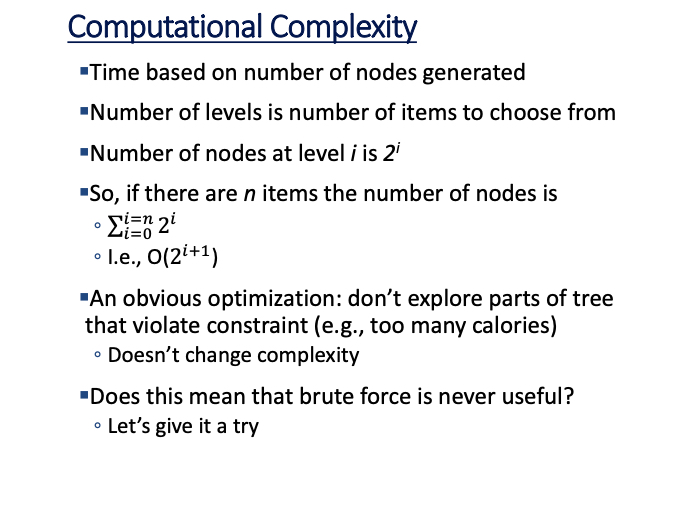

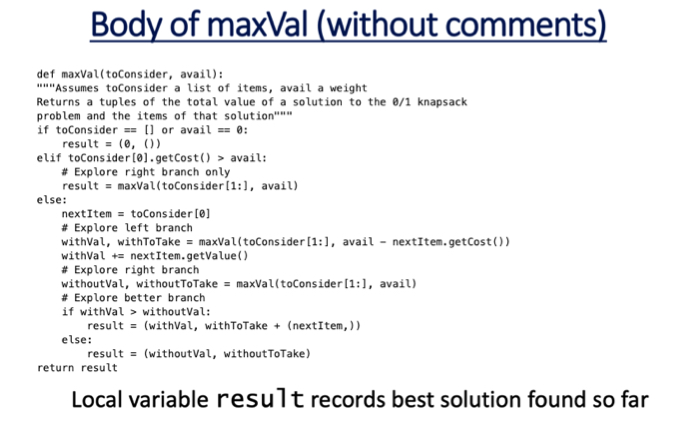
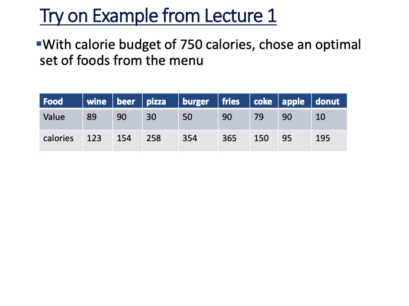


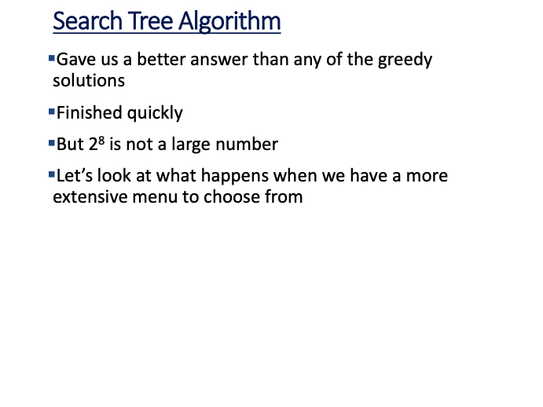
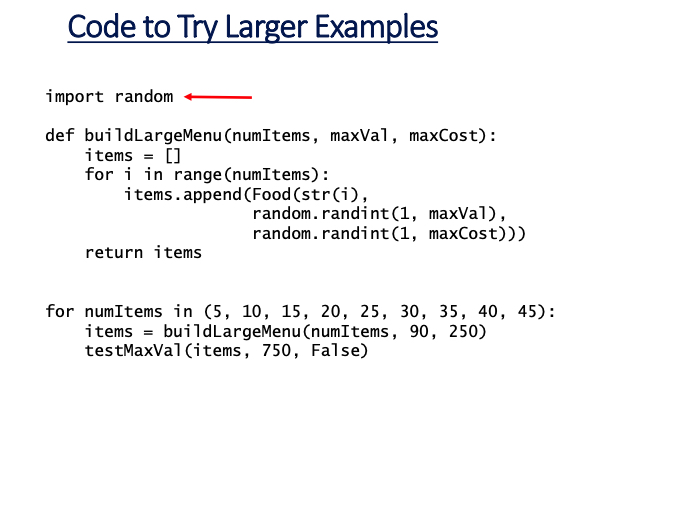
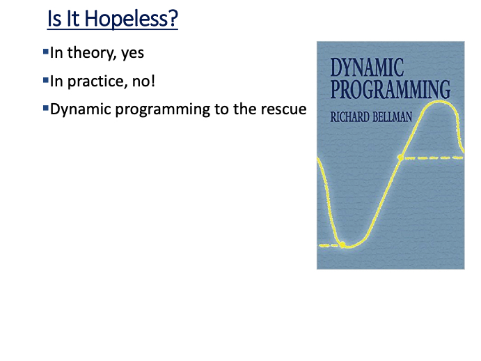
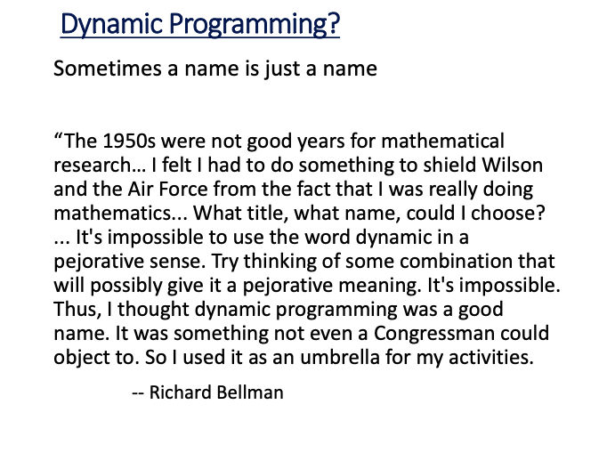
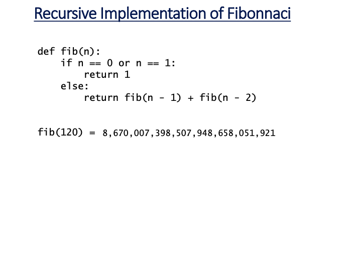
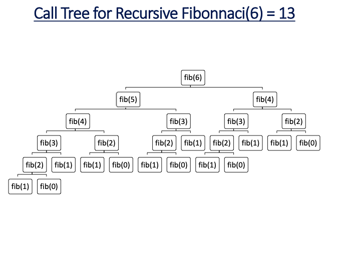
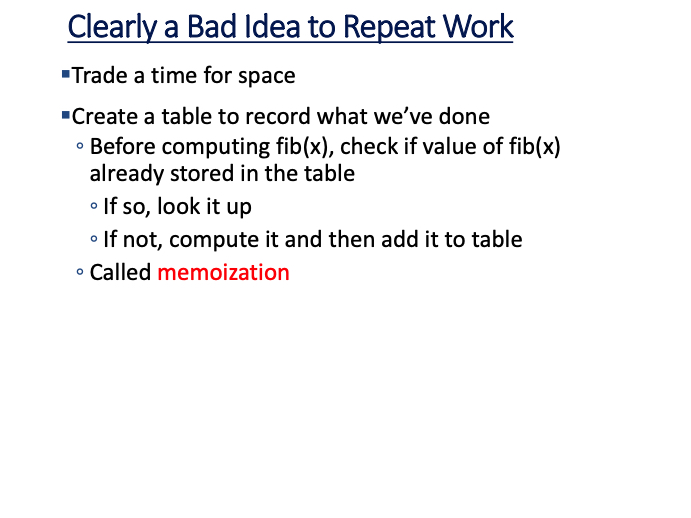
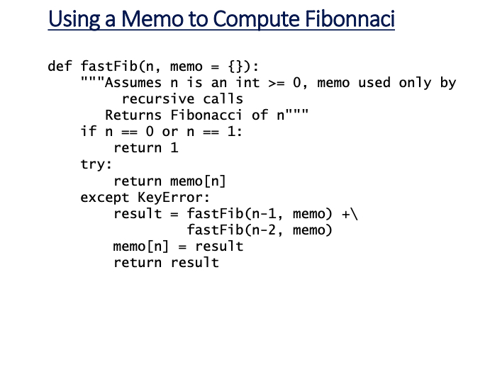
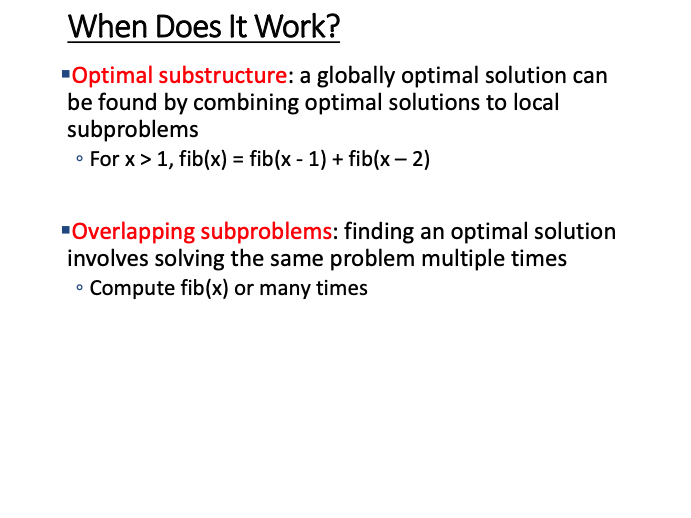
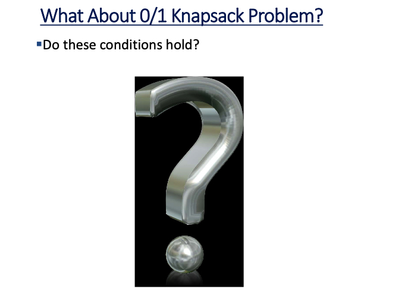
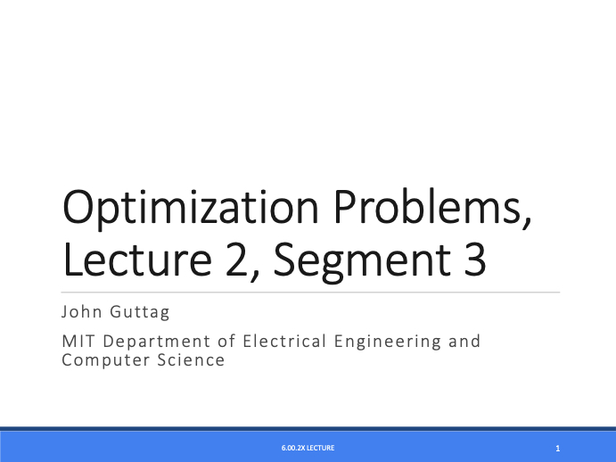
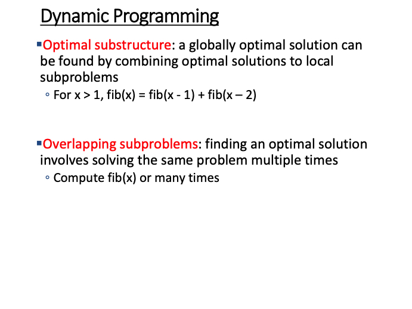
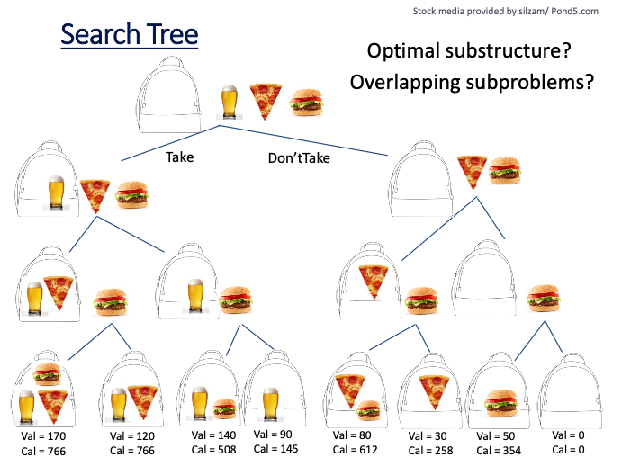
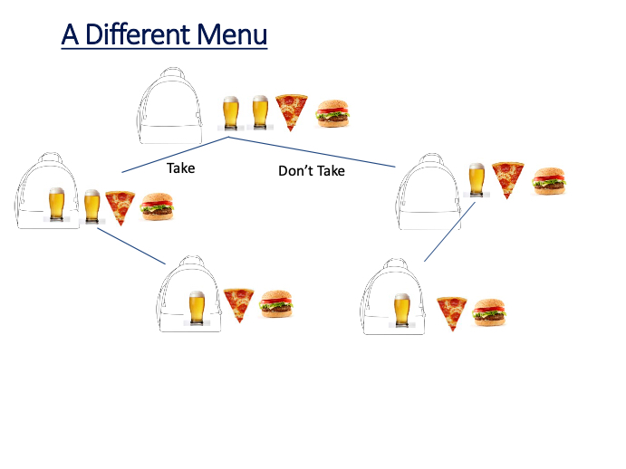

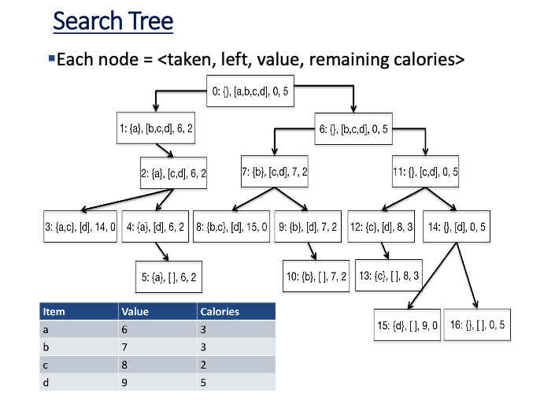
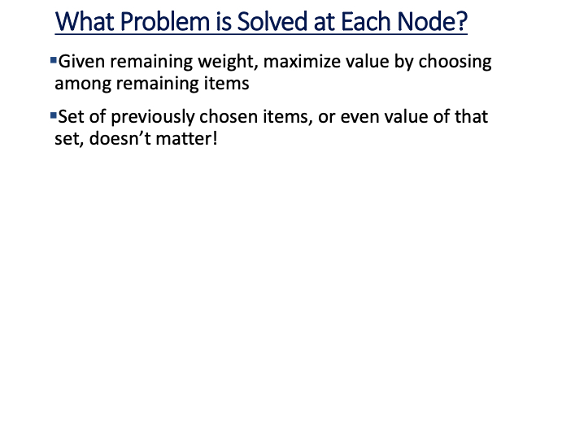
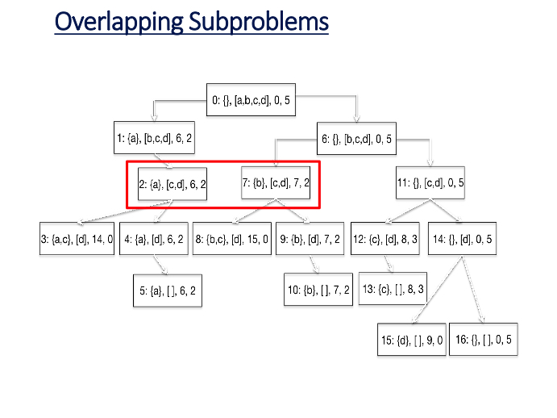

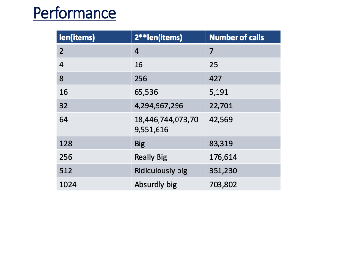
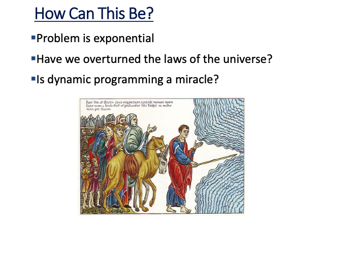
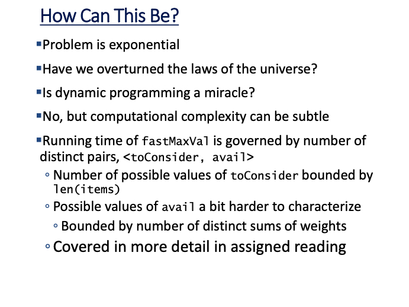
